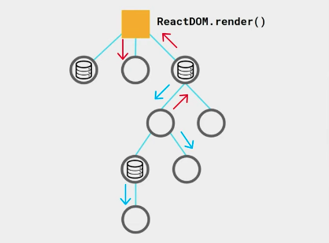
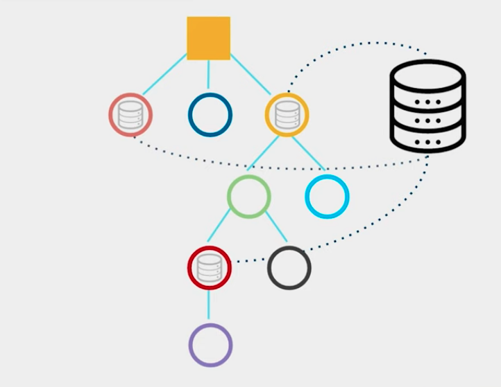

# Redux

## Qué es Redux?
Redux es una herramienta que nos permite almacenar todo el estado de una aplicacion en un solo lugar.

### Principios
- Almacenamiento: Es para utilizarse en los estados, que se puedan almacenar en un nuevo lugar.
- Inmutable: No se están sobreescribiendo estados, sino que se van generando nuevos estados
- Centralizado: Se va a almacenar en un solo lugar

### Cómo funciona?
En una aplicacion de React sin Redux, el DOM está compuesto por elementos, algunos de ellos tendrán estado para manejar los datos, y otros no.

Pasar información de un componente a otro implica ir comunicando el estado entre padres e hijos para llevarlo de un nodo a otro.

Con redux se trabaja un estado global, al cual se suscriben y desuscriben los componentes cuando se requiera. Eso facilita la comunicacion entre componentes.

### Cuándo usar Redux?

- Aplicaciones Grandes, donde se necesite un flujo complejo de informacion entre componentes.
- Cuando se necesita compartir información, por ejemplo un login.
- Solamente para manejar estados (información), no formatos.

## Las Fases de Redux
